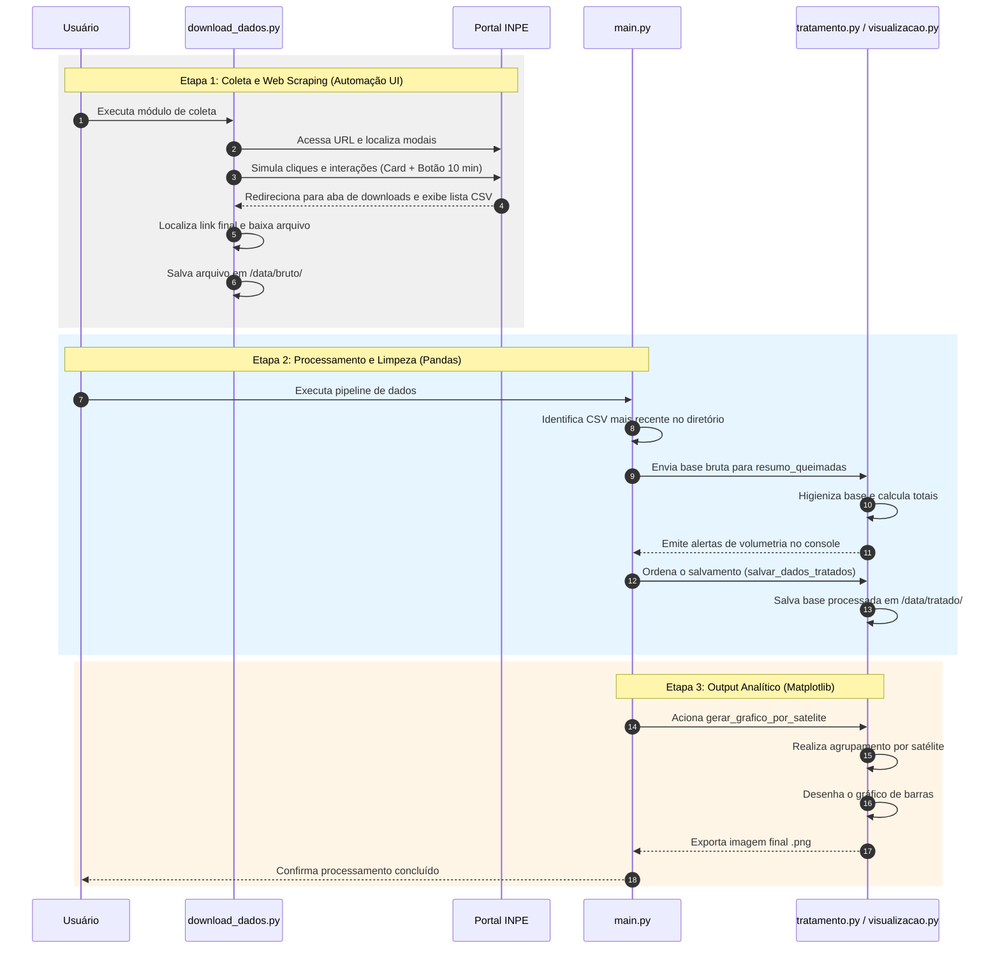

# Arquitetura e Fluxo de Execução do Robô

```mermaid
sequenceDiagram
    autonumber
    participant U as Usuário
    participant D as download_dados.py
    participant P as Portal INPE
    participant M as main.py
    participant T as tratamento.py / visualizacao.py

    rect rgb(240, 240, 240)
        Note over U, P: Etapa 1: Coleta e Web Scraping (Automação UI)
        U->>D: Executa módulo de coleta
        D->>P: Acessa URL e localiza modais
        D->>P: Simula cliques e interações (Card + Botão 10 min)
        P-->>D: Redireciona para aba de downloads e exibe lista CSV
        D->>D: Localiza link final e baixa arquivo
        D->>D: Salva arquivo em /data/bruto/
    end

    rect rgb(230, 245, 255)
        Note over U, M: Etapa 2: Processamento e Limpeza (Pandas)
        U->>M: Executa pipeline de dados
        M->>M: Identifica CSV mais recente no diretório
        M->>T: Envia base bruta para resumo_queimadas
        T->>T: Higieniza base e calcula totais
        T-->>M: Emite alertas de volumetria no console
        M->>T: Ordena o salvamento (salvar_dados_tratados)
        T->>T: Salva base processada em /data/tratado/
    end

    rect rgb(255, 245, 230)
        Note over M, T: Etapa 3: Output Analítico (Matplotlib)
        M->>T: Aciona gerar_grafico_por_satelite
        T->>T: Realiza agrupamento por satélite
        T->>T: Desenha o gráfico de barras
        T-->>M: Exporta imagem final .png
        M-->>U: Confirma processamento concluído
    end
```