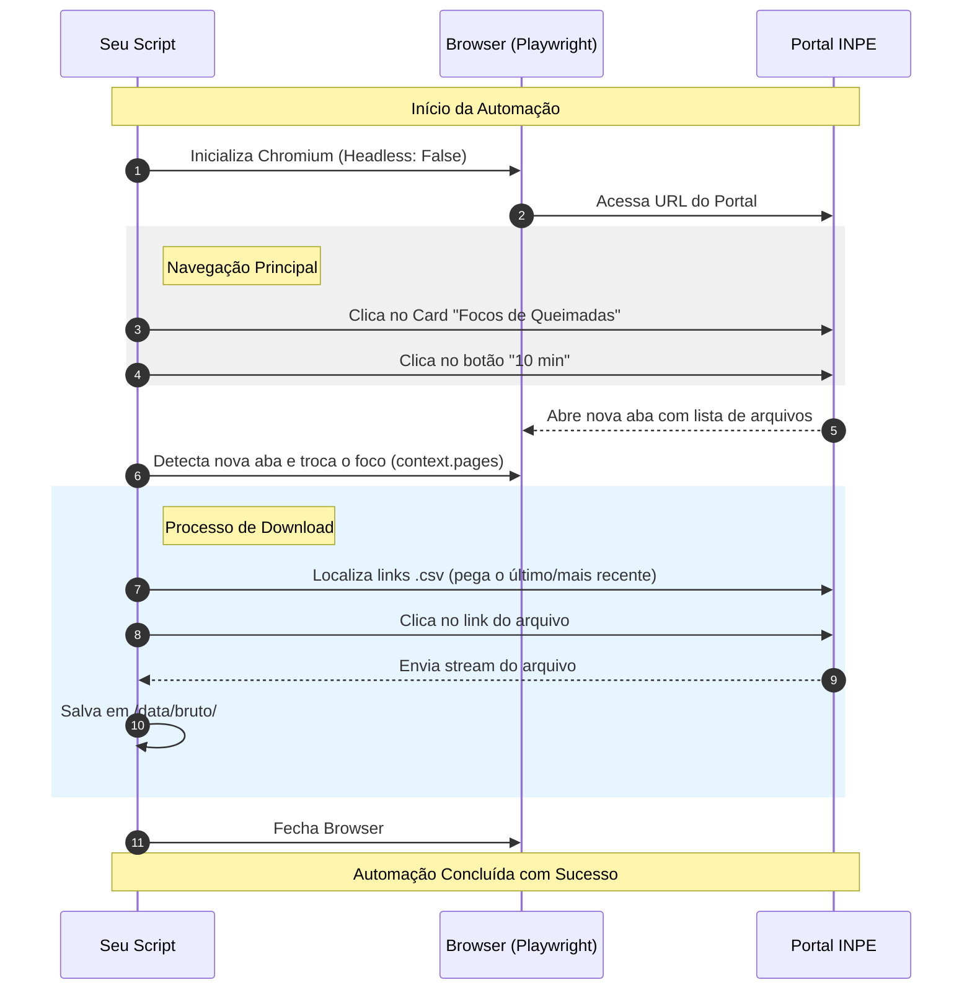

# Sequência de Automação: Download de Focos (INPE)

```mermaid
sequenceDiagram
    autonumber
    participant S as Seu Script
    participant B as Browser (Playwright)
    participant P as Portal INPE

    Note over S, P: Início da Automação
    S->>B: Inicializa Chromium (Headless: False)
    B->>P: Acessa URL do Portal
    
    rect rgb(240, 240, 240)
        Note right of S: Navegação Principal
        S->>P: Clica no Card "Focos de Queimadas"
        S->>P: Clica no botão "10 min"
    end

    P-->>B: Abre nova aba com lista de arquivos
    S->>B: Detecta nova aba e troca o foco (context.pages)

    rect rgb(230, 245, 255)
        Note right of S: Processo de Download
        S->>P: Localiza links .csv (pega o último/mais recente)
        S->>P: Clica no link do arquivo
        P-->>S: Envia stream do arquivo
        S->>S: Salva em /data/bruto/
    end

    S->>B: Fecha Browser
    Note over S, P: Automação Concluída com Sucesso
```